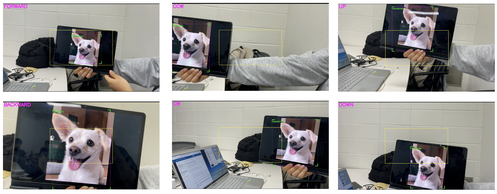

# D-log

Dron & Robotics Term Project

Purpose: Freely shoot various images of dogs using drones


<br>

## Difficulites & Implementation


### 1. Movement



**Difference** <br>
→ It is difficult to change direction naturally while tracking.

**Implementation** <br>
→ Calculate the ratio between the detecting box and the screen to make the drone turn.

<br>

### 2. Afraid

**Difference**

→ Dogs are scared of drones

**Implementation**
→ Replace with a picture of a dog instead of a real dog

<br>

### 3. Recording

**Before**<br>

> https://user-images.githubusercontent.com/71388566/201588039-5fa83593-9e6f-4e01-813b-0e81cf316aa2.mov


<br>

**After**<br>

> https://user-images.githubusercontent.com/71388566/201588551-ddaebe95-6991-49fe-ac34-fa0543d81db3.mp4


<br>

**Difficulties**<br>
→ Recording is interrupted while the drone is performing a directional change or movement command.

**Implementation**<br>
→ Find function ```send_rc_control(lr, fb, ud, yv)``` from [tello page](https://djitellopy.readthedocs.io/en/latest/tello/#djitellopy.tello.Tello.move_forward)


<br>

## **Limitations & Improvements**

### Drone Hardware

**Limitations**<br>
→ Our drones cannot record from top to bottom.

**Improvements**<br>
→ If the drone can change the direction of the camera, it can record from top to bottom. (ex. gimbal)


<br>

## Demo video <br>

> https://user-images.githubusercontent.com/71388566/201589744-4a496cda-ae8d-479c-8b7f-5800c18736e2.mov


